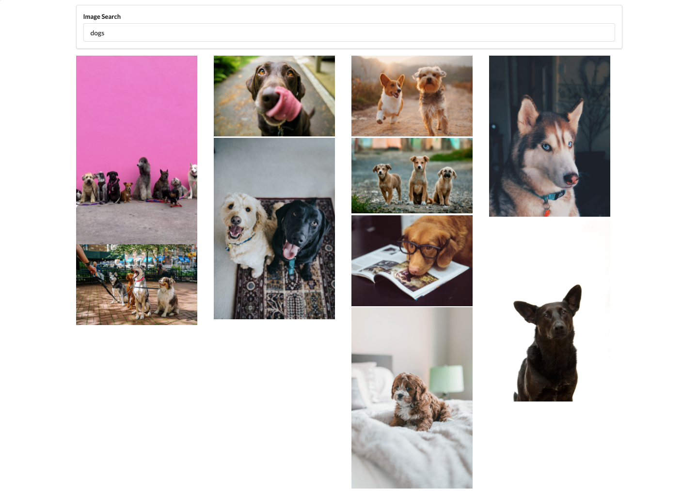

# Search Tool

## Description

This is a React Practice Application built while taking the Udemy course "Modern React with Redux" by Stephen Grider.

## Table of Contents
[Screenshots](https://github.com/sranson/search-tool#Screenshots)

[Contributing](https://github.com/sranson/search-tool#Contributing)

## Screenshots
 

 

## Contributing

Stephen Grider (Instructor)

Unsplash Developers (https://unsplash.com/developers)
